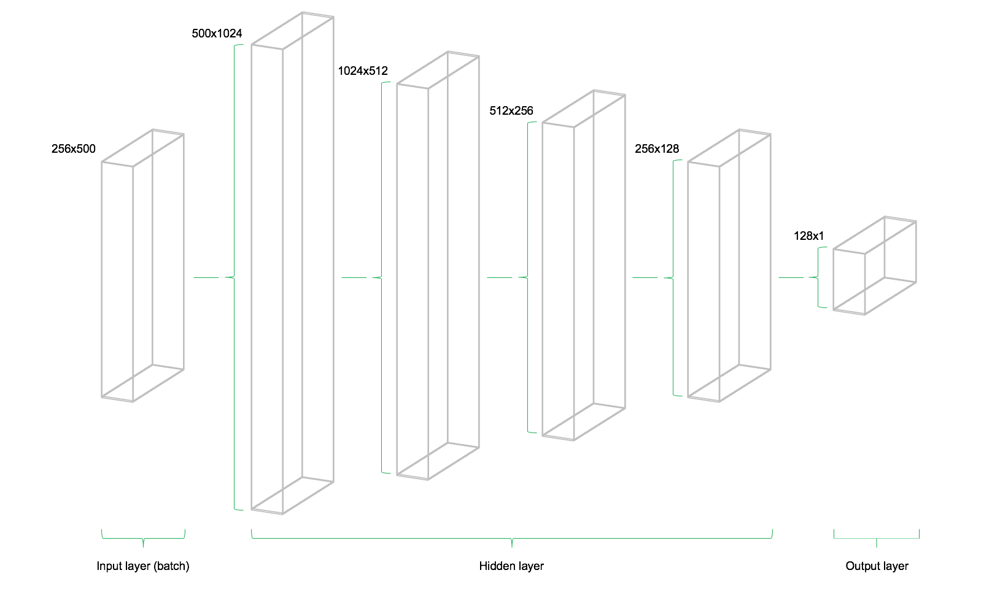
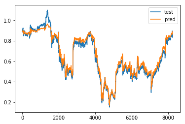

# 股票价格预测

## 01 股票数据

使用参考资料1中Sebastian Heinz整理的数据（[data_stocks.csv](./data_stocks.csv)），部分数据如下图所示。

- 数据共502列，502列分别为：
  - DATE(时间)，
  - SP500(标准普尔500指数指数)，
  - 500支个股股票名(分别为:NASDAQ.AAL *美国航空*, NASDAQ.AAPL *苹果*,NASDAQ.ADBE *Adobe系统*  ... )

- 数据共41266行，包含41266分钟的数据，范围从2017-09-01到2017-04-03股票的实时数据


用pandas读取csv文件为DataFrame：

```python
# 用pandas读取csv文件为DataFrame
data = pd.read_csv('./data_stocks.csv')
# describe()函数查看特征的数值分布
# data.describe()

# 打印数据的基本信息
data.info()
'''
输出结果为：
<class 'pandas.core.frame.DataFrame'>
RangeIndex: 41266 entries, 0 to 41265             # 数据共41266行
Columns: 502 entries, DATE to NYSE.ZTS       # 数据共502列，502列分别为：DATE(时间)，SP500(大盘指数)，										 # 其他(有500列，分别为:NASDAQ.AAL, NASDAQ.AAPL,...)
dtypes: float64(501), int64(1)
memory usage: 158.0 MB
'''

# head()默认显示前5行的数据
data.head()
'''
DATE    SP500    NASDAQ.AAL    NASDAQ.AAPL    NASDAQ.ADBE    NASDAQ.ADI    NASDAQ.ADP   ...
1491226200    2363.6101    42.33    143.68    129.63    82.04    102.23    85.22 ...
1491226260    2364.1001    42.36    143.7    130.32    82.08    102.14    85.65 ...
1491226320    2362.6799    42.31    143.6901    130.225    82.03    102.2125    85.51 ...
1491226380    2364.3101    42.37    143.64    130.0729    82    102.14    85.4872 ...

'''

# 查看时间跨度
print(time.strftime('%Y-%m-%d', time.localtime(data['DATE'].max())),     #获取最大时间
      time.strftime('%Y-%m-%d', time.localtime(data['DATE'].min())))     #获取最小时间
# 2017-09-01 2017-04-03

# 绘制大盘趋势折线图
plt.plot(data['SP500'])         # 把SP500列的数据取出来，绘制折线图
plt.xlabel("Time")
plt.ylabel("SP500")
plt.title("SP500 time series")
# plt.show()

```

大盘趋势折线图：


## 02 数据处理

用pandas的各种函数处理数据：

```python
# ==== 去掉DATE一列，训练集测试集分割
data.drop('DATE', axis=1, inplace=True)                 # 去掉DATE列
data_train = data.iloc[:int(data.shape[0] * 0.8), :]    # 将[前80%行,所有列]构成data_train   
data_test = data.iloc[int(data.shape[0] * 0.8):, :]     # 将[后20%行,所有列]构成data_test
print(data_train.shape, data_test.shape)                
# 打印data_train和data_test的结构：(33012, 501) (8254, 501)
# data_train为33012行，501列的数组；data_test为8254行，501列的数组

'''
print(data_train)
SP500  NASDAQ.AAL  NASDAQ.AAPL  NASDAQ.ADBE  NASDAQ.ADI  ...
0      2363.6101     42.3300     143.6800     129.6300     82.0400   ...
1      2364.1001     42.3600     143.7000     130.3200     82.0800   ...
...  
33010  2474.8601     50.5200     157.8701     146.6000     78.8800   ...
33011  2474.6201     50.5200     157.8000     146.5300     78.8600   ...
'''
# ==== 数据归一化
# 用fit()函数把data.train和data_test的数据映射到(-1,1)
scaler = MinMaxScaler(feature_range=(-1, 1))
scaler.fit(data_train)
data_train = scaler.transform(data_train)
data_test = scaler.transform(data_test)
'''
print(data_train)  
[[-0.5515494  -0.78013925 -0.6376737  ..., -0.89728097 -0.24863686 -0.81802426]
 ..., 
 [ 0.8926691   0.42030048  0.81574884 ...,  0.98716012 -0.70338059 0.60138648]]
 
'''
# 最终的data_train为33012行, 501列，且元素都在(-1,1)的列表；
# data_test为8254行, 501列，且元素都在(-1,1)的列表；

```


## 03 同步预测

**同步预测**是指，使用当前时刻的500支个股价，**预测当前时刻的大盘指数SP500**，即使用'NASDAQ.AAL  NASDAQ.AAPL  NASDAQ.ADBE  NASDAQ.ADI...'500列的数据，预测SP500（大盘指数）
这是一个回归问题，输⼊入共500维特征，输出一维，即[None, 500] => [None, 1]
使用TensorFlow实现同步预测，主要用到多层感知机（Multi-Layer Perceptron，MLP），损失函数⽤用均⽅误差（Mean Square Error，MSE），多层感知机的构架为：



```python
X_train = data_train[:, 1:]     # X-train='NASDAQ.AAL  NASDAQ.AAPL  NASDAQ.ADBE ...'500列(所有行)
y_train = data_train[:, 0]      # Y_train='SP500'列(所有行)
X_test = data_test[:, 1:]
y_test = data_test[:, 0]
print(X_train.shape, y_train.shape, X_test.shape, y_test.shape)
# (33012, 500) (33012,) (8254, 500) (8254,)

input_dim = X_train.shape[1]   # 输入维度input_dim为X_train的列维度，即input_dim=500
hidden_1 = 1024
hidden_2 = 512
hidden_3 = 256
hidden_4 = 128
output_dim = 1
batch_size = 256
epochs = 10
 
 
X = tf.placeholder(shape=[None, input_dim], dtype=tf.float32)
 
Y = tf.placeholder(shape=[None], dtype=tf.float32)
 
W1 = tf.get_variable('W1', [input_dim, hidden_1], initializer=tf.contrib.layers.xavier_initializer(seed=1))
b1 = tf.get_variable('b1', [hidden_1], initializer=tf.zeros_initializer())
W2 = tf.get_variable('W2', [hidden_1, hidden_2], initializer=tf.contrib.layers.xavier_initializer(seed=1))
b2 = tf.get_variable('b2', [hidden_2], initializer=tf.zeros_initializer())
W3 = tf.get_variable('W3', [hidden_2, hidden_3], initializer=tf.contrib.layers.xavier_initializer(seed=1))
b3 = tf.get_variable('b3', [hidden_3], initializer=tf.zeros_initializer())
W4 = tf.get_variable('W4', [hidden_3, hidden_4], initializer=tf.contrib.layers.xavier_initializer(seed=1))
b4 = tf.get_variable('b4', [hidden_4], initializer=tf.zeros_initializer())
W5 = tf.get_variable('W5', [hidden_4, output_dim], initializer=tf.contrib.layers.xavier_initializer(seed=1))
b5 = tf.get_variable('b5', [output_dim], initializer=tf.zeros_initializer())
 
h1 = tf.nn.relu(tf.add(tf.matmul(X, W1), b1))
h2 = tf.nn.relu(tf.add(tf.matmul(h1, W2), b2))
h3 = tf.nn.relu(tf.add(tf.matmul(h2, W3), b3))
h4 = tf.nn.relu(tf.add(tf.matmul(h3, W4), b4))
out = tf.transpose(tf.add(tf.matmul(h4, W5), b5))  # out的结果需要讲前向传播的结果转置一下，方便后面cost计算
 
cost = tf.reduce_mean(tf.squared_difference(out, Y))
optimizer = tf.train.AdamOptimizer().minimize(cost)

```

运行上述计算流图（完整代码见[Lstm_stocks_SP500_prediction.py](./Lstm_stocks_SP500_prediction.py)），10个epochs测试的结果:

```python
'''
*** Epoch 0:
MSE Train: 0.7262212
MSE Test: 1.4024348
...
*** Epoch 9:
MSE Train: 0.000119511795
MSE Test: 0.0047206827
'''
```

可以看出，通过训练，训练集和测试集的均方误差都在减少，经过10个epochs的训练，误差已经非常小（小于0.005）

在测试集上，不同epochs，模型预测的大盘指数和实际大盘指数变化如下图所示：


从结果可以看出，经过10个epochs的训练，训练的模型预测的大盘指数和实际大盘指数已经非常趋近。


## 04异步预测

异步预测是指，使⽤用历史若⼲干个时刻的⼤盘指数，预测当前时刻的⼤大盘指数，这样才更更加符合预测的定义
例如，使⽤前五个⼤大盘指数，预测当前的⼤盘指数，每组输⼊入包括5个step，每个step对应⼀个历史时刻的⼤盘指数，输出⼀维，即[None, 5, 1] => [None, 1]

### 4.1  使⽤Keras实现异步预测

使⽤Keras实现异步预测，主要⽤用到循环神经⽹络即RNN（Recurrent Neural Network）中的LSTM（Long
Short-Term Memory）

```python

output_dim = 1
batch_size = 256
epochs = 10
seq_len = 5
hidden_size = 128  # 这里就一层神经网络

# 以X_train=0-4行数据，Y_train=第5行数据；
#   X_train=1-5行数据，Y_train=第6行数据；
#   ...这样循环遍历data_train (对data_test同理)
X_train = np.array([data_train[i : i + seq_len, 0] for i in range(data_train.shape[0] - seq_len)])[:, :, np.newaxis]
y_train = np.array([data_train[i + seq_len, 0] for i in range(data_train.shape[0]- seq_len)])
X_test = np.array([data_test[i : i + seq_len, 0] for i in range(data_test.shape[0]- seq_len)])[:, :, np.newaxis]
y_test = np.array([data_test[i + seq_len, 0] for i in range(data_test.shape[0] - seq_len)])

print(X_train.shape, y_train.shape, X_test.shape, y_test.shape)
# (33007, 5, 1) (33007,) (8249, 5, 1) (8249,)

X = Input(shape=[X_train.shape[1], X_train.shape[2],])
h = LSTM(hidden_size, activation='relu')(X)
Y = Dense(output_dim, activation='sigmoid')(h)

model = Model(X, Y)
model.compile(loss='mean_squared_error', optimizer='adam')
model.fit(X_train, y_train, epochs=epochs, batch_size=batch_size, shuffle=False)
y_pred = model.predict(X_test)
print('MSE Train:', model.evaluate(X_train, y_train, batch_size=batch_size))
print('MSE Test:', model.evaluate(X_test, y_test, batch_size=batch_size))
plt.plot(y_test, label='test')
plt.plot(y_pred, label='pred')
plt.legend()
plt.show()

```

完整代码见：[Lstm_stock_keras.py](./Lstm_stock_keras.py)

运行结果：

MSE Train: 0.10340568840537946

MSE Test: 0.0040789693311443454



### 4.2  使⽤tensorflow实现异步预测

这里代码见：[Lstm_stock_tensorflow.py](./Lstm_stock_tensorflow.py) 代码没完整，正在研读TensorFlow中LSTM模块的源代码。


-----

**参考资料**

1. Sebastian Heinz：[A simple deep learning model for stock price prediction using TensorFlow](<https://medium.com/mlreview/a-simple-deep-learning-model-for-stock-price-prediction-using-tensorflow-30505541d877>)
2. [使用TensorFlow进行股票价格预测的简单深度学习模型（翻译）](<https://blog.csdn.net/yu444/article/details/86563786>)
3. 深度有趣 - 人工智能实战项目合集：[10 股票价格预测](<https://github.com/Honlan/DeepInterests>)
4. [TensorFlow中RNN实现的正确打开方式](https://zhuanlan.zhihu.com/p/28196873)